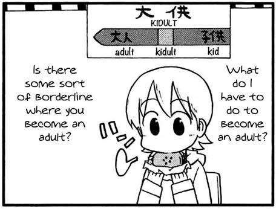

####<code>joaopasantos@github:~$ whoami</code>
Olá! Meu nome é João Pedro. Tenho 19 anos.
Sou formado em Análise de Sistemas, e estou cursando Ciência da Computação.
Ainda não tenho uma linguagem de foco, mas já desenvolvi alguns projetos utilizando **C**, **Java**, **Python**, e **JS**. 
Atualmente estou estudando **PHP**, e futuramente pretendo estudar **Node.js** e **Angular**.
___